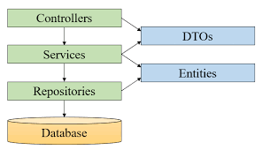
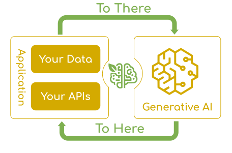

# 服务器端

服务器使用 Kotlin 语言，主要利用 Spring 框架提供高效 RESTful API 接口。

## 1.1 基础功能

### 1.1.1 POJO 定义

**实体类**

通过 Spring JPA 集成 Hibernate 采用 DDL 语言定义数据库进行数据库定义，并利用注解对数据表进行调整。

```kotlin
@Entity @Table(name = "users")
data class User(

    // ===== Auth information =====
    @Id @GeneratedValue(strategy = GenerationType.IDENTITY)
    var id: Long? = null,
    var username: String,
    var email: String,
    var password: String,
    
    // ===== Extended info =====
    var role: Role? = Role.STUDENT,
    var googleId: String? = null,
    var teacherProfile: TeacherProfile? = null,
    var wallet: Wallet? = null,
    
    // ===== Profile information =====
    var phoneNumber: String? = null,
    var avatarUrl: String? = null,
    var realName: String? = null,
    var gender: String? = null,
    var wechatId: String? = null,
    var qqId: String? = null,
    var address: String? = null,
    var createdAt: LocalDateTime = LocalDateTime.now()
) {
    companion object {
        @EntityGraph(attributePaths = ["id", "username"])
        @JvmStatic
        fun basicProjection() = this
    }
}
```


**枚举类**

在设计用户类别时，设定了多个用户角色来区分不同身份。

> 这里的枚举类包用 enums，避免与原来的 enum 包冲突。

```kotlin
package cn.arorms.android.ht.server.enums

enum class Role {
    STUDENT,
    PARENT,
    TEACHER,
    ADMIN,
}
```

其中，枚举类与数据库的对应默认是数字，为了方便维护和易读性，手动定义成字符串枚举类

```kotlin
@Enumerated(EnumType.STRING)
var role: Role? = Role.STUDENT,
```

**外键**

在实体类中，我们使用 JPA 注解来定义外键关系。例如，在 `User` 实体中，`teacherProfile` 字段通过 `@OneToOne` 注解与 `TeacherProfile` 实体建立一对一关系：

```kotlin
@OneToOne
@JoinColumn(name = "teacher_profile_id")
var teacherProfile: TeacherProfile? = null,
```

同样，在 `ChatMessage` 实体中，我们使用 `@ManyToOne` 注解定义与 `User` 和 `ChatDialogue` 的多对一关系：

```kotlin
@ManyToOne(fetch = FetchType.LAZY)
@JoinColumn(name = "dialogue_id")
var dialogue: ChatDialogue?,

@ManyToOne(fetch = FetchType.LAZY)
@JoinColumn(name = "sender_id", nullable = false)
var sender: User,
```

这些外键关系确保了数据的一致性和完整性，同时支持高效的关联查询。

**数据传输类 (DTO)**

数据传输类（Data Transfer Object）用于在层之间传输数据，避免直接暴露实体类。DTO 通常包含与实体类相似的字段，但可以根据需要调整结构。例如，`UserDto` 用于用户信息的传输：

```kotlin
data class UserDto(
    var id: Long? = null,
    val username: String? = null,
    val email: String? = null,
    val phoneNumber: String? = null,
    val avatarUrl: String? = null,
    val realName: String? = null,
    val gender: String? = null,
    val wechatId: String? = null,
    val qqId: String? = null,
    val address: String? = null,
    val password: String? = null,
    val teacherProfile: TeacherProfileDto? = null
) {
    constructor(user: User) : this(
        id = user.id,
        username = user.username,
        email = user.email,
        // ... 其他字段映射
    )
}
```

DTO 的主要优点包括：
1. **数据封装**：隐藏实体类的内部结构
2. **安全性**：避免暴露敏感字段（如密码哈希）
3. **灵活性**：可以根据不同接口需求定制数据结构
4. **性能优化**：只传输需要的字段，减少网络开销

### 1.1.2 数据基础操作

项目采用典型的三层架构进行数据操作：

1. **Repository 层（数据访问层）**：
   - 继承 Spring Data JPA 的 `JpaRepository` 接口
   - 提供基本的 CRUD 操作和自定义查询方法
   - 示例：`UserRepository` 提供根据用户名、邮箱查找用户的方法

2. **Service 层（业务逻辑层）**：
   - 包含业务逻辑和事务管理
   - 调用 Repository 层进行数据操作
   - 处理业务规则和数据验证
   - 示例：`UserService` 处理用户注册、登录、资料更新等业务

3. **Controller 层（表现层）**：
   - 接收 HTTP 请求并返回响应
   - 调用 Service 层处理业务逻辑
   - 使用 DTO 进行数据传输
   - 示例：`UserController` 提供用户相关的 RESTful API

这种分层架构确保了代码的清晰分离，提高了可维护性和可测试性。每层都有明确的职责，遵循单一职责原则。



## 1.2 实时通讯

本项目中的实时聊天模块是基于 WebSocket 技术，并使用了 STOMP（Simple Text Oriented Messaging Protocol）协议构建的，旨在提供用户和教师之间、以及与 AI 代理之间 的低延迟、高效率的实时通信。

### 1.2.1 WebSocket 协议介绍

WebSocket 是一种在单个 TCP 连接上进行全双工通信的协议，与传统的 HTTP 请求-响应模式相比，它提供了真正的双向实时通信能力。WebSocket 的主要特点包括：

1. **持久连接**：建立连接后，客户端和服务器可以保持长时间的连接，避免了 HTTP 的频繁连接建立和断开开销。
2. **双向通信**：客户端和服务器都可以主动发送消息，实现了真正的实时交互。
3. **低延迟**：消息传输延迟低，适合实时聊天、在线游戏等场景。
4. **轻量级协议**：相比 HTTP，WebSocket 协议头更小，传输效率更高。

在项目中，我们使用 Spring Framework 的 WebSocket 支持来建立 WebSocket 端点，客户端通过 `ws://` 或 `wss://` 协议连接到服务器。

**WebSocket vs HTTP 对比**


### 1.2.2 STOMP 协议介绍

STOMP（Simple Text Oriented Messaging Protocol）是一个简单的文本导向的消息传递协议，它运行在 WebSocket 之上，为实时通信提供了更高级的抽象。STOMP 的主要特点包括：

1. **消息模式**：支持发布-订阅（PUB/SUB）和点对点（P2P）两种消息模式。
2. **目的地概念**：使用目的地（Destination）来组织消息，客户端可以订阅特定目的地的消息。
3. **帧格式**：STOMP 使用简单的帧格式，易于解析和调试。
4. **命令集**：提供 CONNECT、SEND、SUBSCRIBE、UNSUBSCRIBE 等命令，简化了消息传递的逻辑。

在项目中，我们使用 Spring 的 STOMP over WebSocket 实现，通过配置消息代理（Message Broker）来管理消息的路由和分发。

**STOMP over WebSocket 架构**


### 1.2.3 项目中的实时通讯架构

本项目通过 WebSocket + STOMP 构建了完整的实时聊天系统，架构如下：

1. **WebSocket 端点配置**：
   ```kotlin
   @Configuration
   @EnableWebSocketMessageBroker
   class WebSocketConfig : WebSocketMessageBrokerConfigurer {
       override fun registerStompEndpoints(registry: StompEndpointRegistry) {
           registry.addEndpoint("/ws")
               .setAllowedOriginPatterns("*")
       }
       
       override fun configureMessageBroker(config: MessageBrokerRegistry) {
           config.enableSimpleBroker("/topic", "/queue")
           config.setApplicationDestinationPrefixes("/app")
       }
   }
   ```

2. **消息路由机制**：
   - 客户端通过 `/app` 前缀发送消息到服务器
   - 服务器通过 `/topic` 或 `/queue` 前缀向客户端广播消息
   - 例如：用户发送消息到 `/app/chat/{dialogueId}/send`，服务器处理后广播到 `/topic/dialogue/{dialogueId}`

3. **消息处理控制器**：
   ```kotlin
   @Controller
   class ChatWebSocketController {
       @MessageMapping("/chat/{dialogueId}/send")
       @SendTo("/topic/dialogue/{dialogueId}")
       fun sendMessage(
           @DestinationVariable dialogueId: Long,
           @Payload messageDto: ChatMessageDto
       ): ChatMessageDto {
           // 处理消息并保存到数据库
           // 广播给所有订阅该对话的客户端
       }
   }
   ```

### 1.2.4 数据模型构建

为了支持实时聊天功能，我们设计了以下核心数据模型：

**1. 会话（ChatDialogue）**

会话代表一个聊天对话，可以是私聊（两个用户）或群聊（多个用户）。

```kotlin
@Entity
@Table(name = "chat_dialogue")
data class ChatDialogue(
    @Id @GeneratedValue(strategy = GenerationType.IDENTITY)
    var id: Long? = null,
    
    @Enumerated(EnumType.STRING)
    var dialogueType: DialogueType, // PRIVATE 或 GROUP
    
    var title: String? = null, // 群聊标题
    
    @OneToMany(mappedBy = "dialogue")
    var participants: MutableList<ChatDialogueParticipant> = mutableListOf(),
    
    @OneToMany(mappedBy = "dialogue")
    var messages: MutableList<ChatMessage> = mutableListOf(),
    
    var lastMessageContent: String? = null,
    var createdAt: LocalDateTime = LocalDateTime.now(),
    var updatedAt: LocalDateTime = LocalDateTime.now()
)
```

**2. 会话信息（ChatMessage）**
会话信息代表聊天中的单条消息，包含发送者、内容和时间戳。

```kotlin
@Entity
@Table(name = "chat_messages")
data class ChatMessage(
    @Id @GeneratedValue(strategy = GenerationType.IDENTITY)
    var id: Long? = null,
    
    @ManyToOne
    @JoinColumn(name = "dialogue_id")
    var dialogue: ChatDialogue?,
    
    @ManyToOne
    @JoinColumn(name = "sender_id")
    var sender: User, // 关联到用户表
    
    var content: String,
    var createdAt: LocalDateTime = LocalDateTime.now()
)
```

**3. 会话参与者（ChatDialogueParticipant）**

会话参与者建立会话与用户之间的多对多关系，记录用户加入会话的时间。

```kotlin
@Entity
@Table(name = "chat_dialogue_participant")
data class ChatDialogueParticipant(
    @Id @GeneratedValue(strategy = GenerationType.IDENTITY)
    var id: Long? = null,
    
    @ManyToOne
    @JoinColumn(name = "dialogue_id")
    var dialogue: ChatDialogue,
    
    @ManyToOne
    @JoinColumn(name = "participant_user_id")
    var participantUser: User, // 关联到用户表
    
    var joinAt: LocalDateTime = LocalDateTime.now()
)
```

**4. 参与者与用户关联**

参与者通过 `participantUser` 字段关联到 `User` 实体，这样可以通过用户ID查找其参与的所有对话，也可以通过对话ID查找所有参与者。

**关系示意图**：
```
User (用户表)
    ↑
ChatDialogueParticipant (会话参与者表)
    ↑
ChatDialogue (会话表)
    ↓
ChatMessage (消息表)
```

这种数据模型设计支持以下功能：
- 用户可参与多个对话（私聊或群聊）
- 每个对话包含多条消息
- 消息记录发送者和发送时间
- 动态生成对话标题（私聊显示对方用户名，群聊显示参与者列表）
- 实时更新最后消息内容和时间

### 1.2.5 实时通讯流程

1. **连接建立**：客户端通过 WebSocket 连接到 `/ws` 端点，使用 STOMP 协议进行握手。
2. **订阅对话**：客户端订阅 `/topic/dialogue/{dialogueId}` 来接收特定对话的消息。
3. **发送消息**：客户端发送消息到 `/app/chat/{dialogueId}/send`，服务器处理并保存到数据库。
4. **消息广播**：服务器将消息广播到 `/topic/dialogue/{dialogueId}`，所有订阅该对话的客户端实时接收。
5. **状态管理**：客户端可以通过 `/app/chat/{dialogueId}/join` 发送加入消息，服务器广播用户加入状态。

这种架构确保了消息的实时性、可靠性和可扩展性，为用户提供了流畅的聊天体验。


## 1.3 服务器安全

### 1.3.1 基于 Spring Security 的 API 过滤器

1. API 过滤器链 (FilterChain)
2. JWT 的基本介绍
3. RBAC 角色权限控制

### 1.3.2 基于 SMTP 的邮箱验证码管理

为了防止恶意注册和确保用户邮箱的真实性，项目实现了基于 SMTP over SSL 协议的邮箱验证码系统。该系统通过安全的邮件传输协议发送验证码，并结合数据库进行验证码的存储、验证和管理，有效防止了自动化注册和恶意攻击。

**SMTP over SSL 协议的应用**

SMTP（Simple Mail Transfer Protocol）是互联网上用于发送电子邮件的标准协议。然而，传统的 SMTP 协议在传输过程中是明文的，存在安全风险。为此，项目采用了 SMTP over SSL（也称为 SMTPS）协议，它在传输层安全（TLS/SSL）的基础上运行，提供了以下安全特性：

1. **加密传输**：所有邮件内容在传输过程中都被加密，防止中间人攻击和数据窃听。
2. **身份验证**：服务器和客户端之间进行双向身份验证，确保通信双方的真实性。
3. **数据完整性**：通过数字签名确保邮件内容在传输过程中未被篡改。

在项目中，SMTP over SSL 的配置通过 Spring Boot 的邮件配置实现。项目使用 JavaMailSender 作为邮件发送客户端，该客户端自动支持 SMTP over SSL 协议。关键配置在 `application.properties` 文件中：

```properties
# 邮件服务器配置
spring.mail.host=smtp.163.com          # 使用网易163邮箱的SMTP服务器
spring.mail.port=465                   # 使用SSL加密端口465，这是SMTP over SSL的标准端口
spring.mail.properties.mail.smtp.auth=true          # 启用SMTP身份验证
spring.mail.properties.mail.smtp.starttls.enable=true  # 同时支持STARTTLS，提供向后兼容性
spring.mail.properties.mail.smtp.ssl.enable=true    # 启用SSL加密
```

实际的邮箱用户名和密码通过 `keys.properties` 文件导入，避免将敏感信息直接写入代码。


**邮箱验证码系统架构**

邮箱验证码系统采用三层架构设计：

1. **数据层**：使用 `EmailVerificationCode` 实体类存储验证码信息，通过 JPA 与数据库交互。
2. **服务层**：`VerificationCodeService` 处理验证码的生成、验证和管理逻辑，`EmailService` 负责邮件发送。
3. **控制层**：`AuthController` 提供验证码发送和验证的 RESTful API 接口。

**数据模型设计**

验证码数据模型包含以下关键字段，确保系统的安全性和可靠性：

```kotlin
@Entity
@Table(name = "email_verification_codes")
data class EmailVerificationCode(
    @Id
    @GeneratedValue(strategy = GenerationType.IDENTITY)
    var id: Long? = null,

    @Column(nullable = false, unique = true)
    var email: String,           // 邮箱地址

    @Column(nullable = false, length = 6)
    var code: String,           // 6位数字验证码

    @Column(nullable = false)
    var expiresAt: LocalDateTime, // 过期时间（5分钟后）

    @Column(nullable = false)
    var verified: Boolean = false, // 是否已验证

    @Column(nullable = false)
    var attempts: Int = 0,       // 尝试次数（防止暴力破解）

    @Column(nullable = false)
    var createdAt: LocalDateTime = LocalDateTime.now()
) {
    // 检查验证码是否过期
    fun isExpired(): Boolean {
        return LocalDateTime.now().isAfter(expiresAt)
    }
    
    // 检查验证码是否有效（未过期、未验证、尝试次数未超限）
    fun isValid(): Boolean {
        return !isExpired() && !verified && attempts < 5
    }
    
    // 增加尝试次数
    fun incrementAttempts() {
        attempts++
    }
}
```

**验证码生成与发送流程**

1. **验证码生成**：系统生成6位随机数字验证码，并设置5分钟有效期。
   ```kotlin
   @Transactional
   fun generateVerificationCode(email: String): String {
       // 删除该邮箱之前的验证码，防止重复
       emailVerificationCodeRepository.deleteByEmail(email)
       
       // 生成6位数字验证码（100000-999999）
       val code = (100000..999999).random().toString()
       
       // 创建验证码记录，设置5分钟有效期
       val verificationCode = EmailVerificationCode(
           email = email,
           code = code,
           expiresAt = LocalDateTime.now().plusMinutes(5)
       )
       
       emailVerificationCodeRepository.save(verificationCode)
       return code
   }
   ```

2. **邮件发送**：通过 SMTP over SSL 安全发送验证码邮件。
   ```kotlin
   fun sendVerificationCode(email: String, code: String): Boolean {
       try {
           val message = SimpleMailMessage()
           message.setFrom(fromEmail)
           message.setTo(email)
           message.subject = "Heartfelt Tutoring - 邮箱验证码"
           message.text = """
               亲爱的用户：
               
               您的邮箱验证码是：$code
               
               验证码有效期为5分钟，请尽快完成验证。
               
               如果您没有请求此验证码，请忽略此邮件。
               
               祝您使用愉快！
               Arorms 团队
           """.trimIndent()

           mailSender.send(message)
           logger.info("验证码邮件已发送到: $email")
           return true
       } catch (e: Exception) {
           logger.error("发送验证码邮件失败: ${e.message}", e)
           return false
       }
   }
   ```

**验证码验证流程**

1. **验证码验证**：检查验证码的有效性，包括是否匹配、是否过期、是否已验证。
   ```kotlin
   fun verifyCode(email: String, code: String): Boolean {
       val verificationCode = emailVerificationCodeRepository.findByEmailAndCode(email, code)
       
       if (verificationCode == null || !verificationCode.isValid()) {
           return false
       }
       
       // 验证成功，标记为已验证
       verificationCode.verified = true
       emailVerificationCodeRepository.save(verificationCode)
       
       return true
   }
   ```

2. **防止暴力破解**：系统记录尝试次数，超过5次后验证码失效。
   ```kotlin
   fun validateCode(email: String, code: String): Boolean {
       val verificationCode = emailVerificationCodeRepository.findByEmailAndCode(email, code)
       
       if (verificationCode == null || !verificationCode.isValid()) {
           // 增加尝试次数
           verificationCode?.let {
               it.incrementAttempts()
               emailVerificationCodeRepository.save(it)
           }
           return false
       }
       
       return true
   }
   ```

**API 接口设计**

系统提供两个主要的 RESTful API 接口：

1. **发送验证码接口** (`POST /api/auth/send-verification-code`)：
   - 检查邮箱是否已被注册
   - 生成验证码并发送邮件
   - 返回发送结果

2. **验证邮箱接口** (`POST /api/auth/verify-email`)：
   - 验证验证码的正确性
   - 标记邮箱为已验证状态
   - 允许用户完成注册

**安全特性**

1. **时效性控制**：验证码5分钟后自动过期，防止长期有效带来的安全风险。
2. **次数限制**：每个验证码最多尝试5次，防止暴力破解。
3. **唯一性保证**：同一邮箱同时只能有一个有效验证码，新验证码会覆盖旧验证码。
4. **防重放攻击**：验证码一旦验证成功即标记为已验证，不能重复使用。
5. **安全传输**：通过 SMTP over SSL 确保验证码在传输过程中的安全性。

**系统优势**

1. **安全性高**：结合数据库存储和 SMTP over SSL 传输，多重保障验证码安全。
2. **用户体验好**：5分钟有效期既保证了安全性，又给了用户足够的操作时间。
3. **可扩展性强**：系统设计支持未来添加短信验证码等其他验证方式。
4. **易于维护**：清晰的代码结构和合理的分层设计，便于后续维护和升级。

通过这套基于 SMTP over SSL 的邮箱验证码系统，项目有效防止了恶意注册和自动化攻击，同时为用户提供了安全便捷的邮箱验证体验。

### 1.3.3 Oauth2 联合认证

项目采用了流行的 OAuth 2.0 授权框架实现了 Google 联合认证，并通过 JWT (JSON Web Token) 机制将认证过程与 API 资源访问解耦，同时支持 Web 和 Android 客户端。OAuth 2.0 作为一个行业标准的授权协议，其核心设计理念是允许用户在不暴露密码的情况下，授权第三方应用访问其在其他服务提供者上的受保护资源。这种授权模式不仅提升了安全性，还极大地改善了用户体验，用户无需记住额外的账号密码，只需使用已有的 Google 账户即可快速完成认证。

在 OAuth 2.0 的架构中，涉及几个关键角色：资源所有者（即用户）、客户端（本应用）、授权服务器（Google 的 OAuth 服务）和资源服务器（存储用户信息的 Google 服务）。整个授权流程基于访问令牌这一核心概念，客户端通过获取访问令牌来代表用户访问受保护资源，而无需知晓用户的凭据。这种设计将身份验证与授权分离，使得系统更加模块化和安全。


对于 Web 端的实现，项目集成了 Spring Security OAuth2 客户端模块。通过配置 Spring Security 的 OAuth2 登录端点，当用户选择使用 Google 登录时，应用会将用户重定向到 Google 的授权页面。关键配置代码如下：

```kotlin
@Bean
fun securityFilterChain(
    http: HttpSecurity,
    oauth2SuccessHandler: OAuth2SuccessHandler
): SecurityFilterChain {
    http
        .oauth2Login { oauth2 ->
            oauth2
                .userInfoEndpoint { userInfo ->
                    userInfo.userService(oauth2UserService())
                }
                .successHandler(oauth2SuccessHandler)
        }
    return http.build()
}
```

授权成功后，Google 会返回一个授权码，应用服务器使用该授权码向 Google 交换访问令牌和 ID 令牌。ID 令牌包含了用户的身份信息，如 Google ID、邮箱和姓名等。服务器端的 OAuth2 成功处理器负责验证 ID 令牌并生成 JWT：

```kotlin
@Component
class OAuth2SuccessHandler : SimpleUrlAuthenticationSuccessHandler() {
    override fun onAuthenticationSuccess(
        request: HttpServletRequest,
        response: HttpServletResponse,
        authentication: Authentication
    ) {
        val oauth2User = authentication.principal as OAuth2User
        val googleId = oauth2User.attributes["sub"] as String
        val email = oauth2User.attributes["email"] as String
        
        // 检查用户是否存在，不存在则创建新用户
        var user = userService.authenticateUserByGoogle(googleId)
        if (user == null) {
            val newUser = User(
                username = name,
                email = email,
                password = "", // OAuth 用户不需要密码
                googleId = googleId
            )
            user = userService.registerUser(newUser)
        }
        
        // 生成 JWT 令牌
        val token = jwtUtil.generateToken(user)
        response.writer.write("""{"token": "$token", "userId": ${user.id}}""")
    }
}
```

服务器验证 ID 令牌的有效性后，会根据其中的 Google ID 在本地数据库中查找或创建对应的用户账户，并生成项目自身的 JWT 令牌返回给客户端。这样，后续的所有 API 请求都使用这个 JWT 令牌进行身份验证，实现了与 Google 认证的解耦。

在 Android 客户端，项目利用了 Google Identity Services 和 Android Credential Manager API 来提供原生的 Google 登录体验。Credential Manager API 提供了一个统一的界面来管理各种凭据，包括 Google 账户。关键实现代码如下：

```kotlin
// 初始化 Credential Manager
private fun setupGoogleSignIn() {
    credentialManager = CredentialManager.create(requireContext())
}

// 发起 Google 登录
private fun googleSignIn() {
    val googleIdOption = GetGoogleIdOption.Builder()
        .setFilterByAuthorizedAccounts(false)
        .build()
    
    val request = GetCredentialRequest.Builder()
        .addCredentialOption(googleIdOption)
        .build()
    
    credentialManager.getCredential(requireActivity(), request)
        .addOnSuccessListener { credential ->
            val googleIdTokenCredential = GoogleIdTokenCredential.createFrom(credential.data)
            val googleId = googleIdTokenCredential.id
            val displayName = googleIdTokenCredential.displayName ?: "Google User"
            
            // 发送 Google ID 到服务器进行认证
            loginWithGoogle(googleId)
        }
        .addOnFailureListener { exception ->
            // 处理登录失败
        }
}
```

当用户触发 Google 登录时，客户端会调用 Credential Manager 来获取 Google ID 令牌，这个过程会显示系统的账户选择界面，用户可以选择已有的 Google 账户或添加新账户。获取到 ID 令牌后，客户端提取其中的 Google ID 并发送到应用服务器进行验证：

```kotlin
private fun loginWithGoogle(googleId: String) {
    viewModelScope.launch {
        try {
            val response = authRepository.loginWithGoogle(googleId)
            if (response.isSuccessful) {
                val loginResponse = response.body()
                // 保存 JWT 令牌和用户信息
                AuthManager.saveToken(loginResponse?.token)
                AuthManager.saveUser(loginResponse?.user)
            }
        } catch (e: Exception) {
            // 处理错误
        }
    }
}
```

服务器端的处理逻辑与 Web 端一致：验证令牌、查找或创建用户、生成 JWT 令牌并返回。客户端收到 JWT 令牌后将其存储在本地，用于后续的所有 API 请求。

这种设计带来了多方面的优势。首先，从安全角度，用户密码不会暴露给第三方应用，减少了密码泄露的风险；应用服务器也不存储用户密码，降低了数据泄露的潜在影响。其次，用户体验得到显著提升，用户无需经历繁琐的注册流程，一键即可完成登录。再者，系统的可维护性增强，认证逻辑集中在服务器端，客户端只需处理界面交互和令牌管理。此外，这种架构具有良好的可扩展性，未来可以方便地集成其他 OAuth2 提供商，如微信、QQ 等，而无需大幅修改现有代码。

项目中的 OAuth2 实现还特别注意了与现有 JWT 认证机制的融合。无论用户通过传统账号密码登录还是通过 Google OAuth2 登录，最终都会获得统一格式的 JWT 令牌，这使得后续的授权和资源访问逻辑保持一致。服务器端的过滤器会验证每个请求中的 JWT 令牌，并根据其中的用户信息和角色进行访问控制。这种设计确保了整个认证授权体系的一致性和安全性。

综上所述，通过 OAuth2 联合认证，项目构建了一个既安全又便捷的认证系统。它不仅遵循了行业最佳实践，还充分考虑到了实际应用中的用户体验和系统可维护性，为应用的长期发展奠定了坚实的基础。

## 1.4 大语言模型接入

项目通过 Spring AI 框架接入大语言模型 Qwen3-30B-A3B-Instruct，为用户提供智能化的学习辅导和对话功能。Spring AI 是 Spring 官方提供的人工智能集成框架，它简化了与各种大语言模型的交互，提供了统一的 API 接口和丰富的功能支持。该框架通过 `ChatClient` 接口统一访问不同的大语言模型提供商，基于 Spring Boot 的自动配置机制简化模型接入配置，支持 Server-Sent Events (SSE) 流式响应实现实时对话体验，内置提示模板和上下文管理功能，并提供了可扩展的架构支持多种模型提供商和自定义扩展。



在模型配置方面，项目通过 Silicon Flow API 接入 Qwen3-30B-A3B-Instruct 模型。Silicon Flow 是一个提供多种开源大语言模型 API 服务的平台，而 Qwen3-30B-A3B-Instruct 是阿里通义千问团队开发的 300 亿参数指令微调模型，具有强大的推理能力和中文理解能力。配置在 `application.properties` 文件中实现，通过 `spring.ai.openai.base-url` 指定 Silicon Flow API 的端点地址，`spring.ai.openai.chat.options.model` 指定使用的具体模型版本。

项目通过 `AgentService` 类封装 AI 功能，提供两种交互模式：同步生成模式和流式聊天模式。同步生成模式一次性生成完整响应，适用于需要完整答案的场景；流式聊天模式实时流式返回响应，使用 Reactor 的 `Flux` 实现 Server-Sent Events 流式传输，提供更好的用户体验。系统通过提示词设定 AI 角色为"辅导软件助手"，支持通过 `conversationId` 管理对话上下文，确保对话的连贯性和个性化。

在 API 接口设计上，项目通过 `AgentController` 提供 RESTful API 接口。同步生成接口 (`POST /api/ai/generate`) 返回完整的 AI 响应，包含完整的异常处理机制；流式聊天接口 (`POST /api/ai/chat`) 使用 `MediaType.TEXT_EVENT_STREAM_VALUE` 返回 Server-Sent Events，实现实时交互体验。AI 请求通过 `AgentRequest` 数据传输对象进行封装，包含可选的提示词、用户输入的对话消息以及用于管理对话上下文的会话 ID。

Spring AI 在项目中的集成架构形成了清晰的层次结构：客户端通过 HTTP/RESTful API 调用 `AgentController`，控制器调用 `AgentService` 业务逻辑层，服务层通过 Spring AI 的 `ChatClient` 统一接口向 Silicon Flow API 发送请求，最终由 Qwen3-30B-A3B-Instruct 模型进行推理并返回结果。这种架构确保了系统的模块化和可维护性。

在应用场景方面，系统主要提供智能学习辅导、实时对话交互和教育内容生成三大功能。智能学习辅导包括解答学科问题、提供学习指导、生成学习计划和复习建议、解释复杂概念等；实时对话交互支持自然语言对话、上下文感知的连续对话和个性化的学习建议；教育内容生成涵盖生成练习题和答案解析、创建学习材料和总结、提供学习策略建议等。

技术优势体现在多个方面：性能上通过流式响应减少用户等待时间，异步处理提高系统吞吐量，缓存机制优化重复查询；可维护性上采用清晰的代码分层结构、统一的错误处理机制和易于扩展的配置体系；用户体验上提供实时交互反馈、自然流畅的对话体验和个性化的学习支持。

未来扩展方向包括集成更多大语言模型实现多模型支持，根据场景选择最优模型；集成数据库工具为对话提供个性化数据支持；添加文件处理、代码解释、数学计算等专项功能；通过响应缓存、请求合并、模型蒸馏等措施进一步优化性能。

通过 Spring AI 框架的集成，项目构建了一个现代化、可扩展的 AI 对话系统，为用户提供了智能化的学习辅导体验，同时为未来的功能扩展奠定了坚实的技术基础。

# 客户端

客户端是原生的 Android 应用程序，使用 Kotlin 语言和 MVVM 架构构建，确保了应用性能和架构的健壮性。

通过 Retrofit/OkHttp 与后端进行 RESTful API 交互，并通过 STOMP over WebSocket 实现实时聊天功能。此外，客户端集成了 Google 联合认证功能，并利用 Kotlin 协程处理并发，提供了现代化的 Material Design 3 界面和丰富的应用功能，如预约、计划管理和 AI 聊天。

# 管理员端

这是一个基于 React、TypeScript 和 Tailwind CSS 的现代前端应用。
